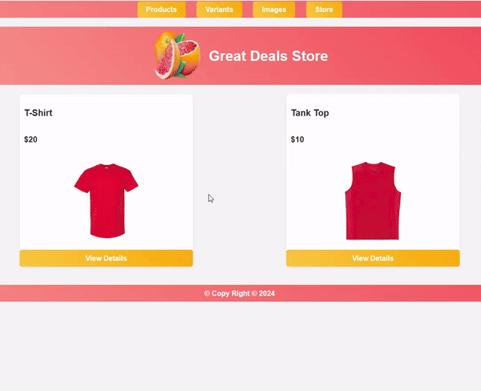

# Ecommerce Store Demo

## Description

This is a Node.js application for an e-commerce demo using Express, MySQL, and Twig templating engine. The application supports product and variant management and serves dynamic content using Sequelize ORM for MySQL. The project is set up to run in a Docker environment, with services for both Node.js and MySQL.



## What You Can Do

In this e-commerce demo application, you can:

- View a list of products and their details, including price, description, and available variants.
- Upload product images and display them in the product views.
- Manage products and variants:
  - Add new products and variants.
  - Update existing products and variants.
  - Remove products and variants.
- Set inventory levels for product variants and track availability.
- Create a dynamic store page that updates based on the available products in the database.

The application includes a basic form structure for creating and updating products, with fields like title, price, description, slug, and inventory.

## Features

- Express.js server for handling routes and requests
- MySQL database with Sequelize ORM
- File uploads using `express-fileupload`
- Custom views using the Twig templating engine
- Dockerized for easy environment setup
- Nodemon for automatic restarts during development

## Prerequisites

Make sure you have the following installed:

- Docker
- Docker Compose

## Installation

1. Clone the repository:

   ```bash
   git clone https://github.com/your-repo/asl_kierra_bretz.git
   cd asl_kierra_bretz
   ```

2. Start the Docker containers:

   ```bash
   docker-compose up
   ```

   This will start both the MySQL and Node.js services.

3. Access the application:

   Open your browser and go to `http://localhost:3000`.

## Scripts

- **`watch`**: Starts the server with Nodemon and watches for changes in `.js` and `.twig` files.

  ```bash
  npm run watch
  ```

## Project Structure

- **`index.js`**: Main entry point of the application.
- **`views/`**: Contains Twig templates for rendering the frontend.
- **`routes/`**: Defines the routes for the application.
- **`models/`**: Sequelize models for database interaction.
- **`public/`**: Public assets like CSS, images, and JavaScript.

## Docker Setup

This project uses Docker to containerize both the Node.js application and MySQL database.

### MySQL Service

- The MySQL service runs on the latest version of MySQL.
- The root password is set to `root`.
- The data is persisted in the `./data` directory on your local machine.

### Node.js Service

- The Node.js service runs on the official Node.js 18 image.
- It installs dependencies and starts the application in development mode using Nodemon.

To rebuild and restart the containers, run:

```bash
docker-compose down && docker-compose up --build
```

## Environment Variables

The following environment variables are used in the Docker services:

- **NODE_ENV**: `development`
- **MYSQL_ROOT_PASSWORD**: `root`

## License

This project is licensed under the ISC License.
